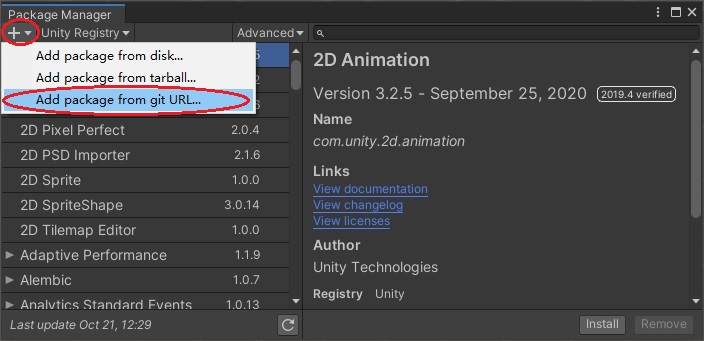

# 使用示例


## 使用git仓库方式导入package到Unity

**注：** 用git仓库方式导入package，并非导入此工具的唯一方式。您亦可将代码及dll文件下载到您的工程中，或者使用npm部署package远程仓库等方式。

**方法1（适用于所有支持package manager版本的Unity）：**

1. 用文本编辑器打开工程目录中Packages/manifest.json

2. 在dependencies中增加一行代码

   ```json
   {
     "dependencies": {
       "com.greatclock.exceltoscriptableobject": "git+https://github.com/greatclock/excel_to_scriptableobject.git",
       ...
     }
   }
   ```

3. 保存文件
4. 回到Unity中，此工具将被自动导入

**方法2（仅支持Unity2019或以上版本）：**

1. 打开Package Manager并点击界面左上角的加号，选择“Add package from git URL...”

   

2. 输入“https://github.com/greatclock/excel_to_scriptableobject.git”并点击“Add”

   

在导入完成后，Project窗口中Packages下会增加“Excel To ScriptableObject”一项。


## 示例内容

### 1. 基础功能

此基础功能示例使用的数据为一组学生数据，其中包含学生姓名性别等基础信息，以及家长及其联系方式等。

此示例同时用于展示数据中基础数据类型、枚举类型、数组类型和数据类型嵌套等的使用。

#### 1.1 从创建新xlsx文件到在运行时读取其定义的数据

[Guide1E1_CN.md](./Guide1E1_CN.md)

- 完整操作流程
- 命名规则
- xlsx文件中使用注释行
- 使用基础数据类型、数组类型
- 读取数据、调试方法

#### 1.2 使用数据类型嵌套

[Guide1E2_CN.md](./Guide1E2_CN.md)

- 在同一个xlsx文件中定义多张表
- 使用自定义的类型并用id或key对数据进行关联
- 隐藏某张表的get方法，使其中数据无法从外部直接读取

#### 1.3 使用枚举类型

[Guide1E3_CN.md](./Guide1E3_CN.md)

- 在表中使用枚举类型
- 在表中预定义枚举类型的枚举值

### 2. 一键对多值

#### 2.1 标识某张表为一键对多值并读取与键对应的全部数据

[Guide2E1_CN.md](./Guide2E1_CN.md)

- 不同表格软件对sheet名称中特殊字符的兼容性
- 避免新建数组或列表对象产生的GC alloc

#### 2.2 在使用数据类型嵌套时，被引用的自定义数据类型为数组的情况

[Guide2E2_CN.md](./Guide2E2_CN.md)

### 3. 字符串类型扩展

#### 3.1 使用多语言特性

[Guide3E1_CN.md](./Guide3E1_CN.md)

- 使用多语言字符串
- 注册多语言键-值转换函数，使读取到的数据直接使用多语言字符串的值

#### 3.2 富文本特性

**注：** 此处富文本是指：文本内容中的某一部分或某几部分，需要根据当前具体逻辑进行填充，如：玩家昵称、当前等级等。并非用于表示文本颜色、尺寸、图文混排等。

[Guide3E2_CN.md](./Guide3E2_CN.md)

- 使用富文本字符串
- 注册富文本转换函数，使读取到的数据直接使用富文本转换过的字符串

### 4. 对表中的字段进行筛选

开发中，敬请期待。。。

