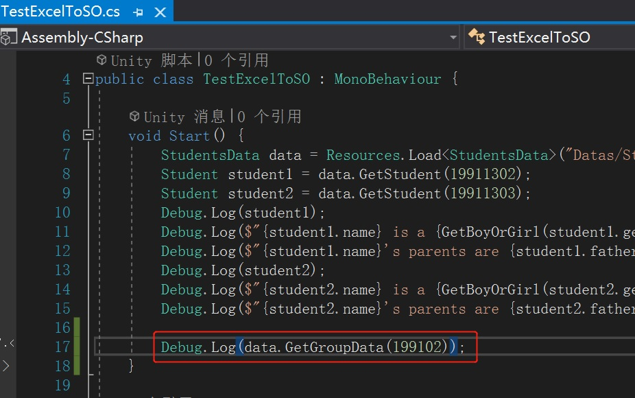
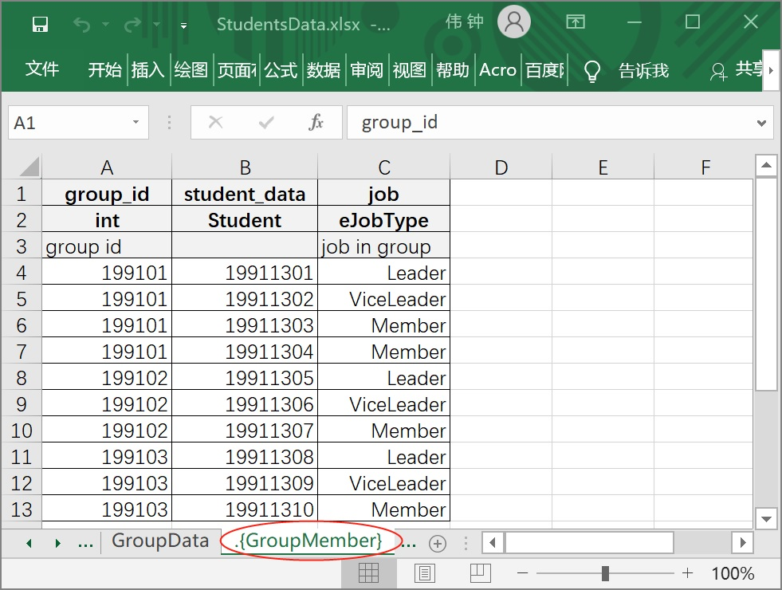

# When using nested types, the field defined as a custom type can be an array

## We Assume You've Finished

Finished the guidance [Marking a sheet as "key to multi values" and reading all items that match](./Guide2E1_EN.md)

## Demands in Guiding

Generally when using nested types, a known type "MyData" defined in a sheet named "MyData", a field named "datas" in another sheet with the type MyData[] or [MyData] will be an array.

If "MyData" is marked as "key to multi values" with the sheet name "{MyData}" or so, the field "datas" will always be an array no matter the type of it is MyData, [MyData] or MyData[].

In this guide, we'll add a new sheet named "GroupData" to define the group in the previous guide. And group members will be a property of GroupData to list all GroupMember typed group members.

## Guiding in Progress

1. Create a new sheet named "GroupData" in StudentsData.xlsx, and fill the sheet with proper data.

   

3. Go back to Unity and execute "Process Excel" for "StudentsData.xlsx".

4. Delete the test codes that added in previous guide in Start method of "TestExcelToSO.cs", and add the following codes :

   

5. Run the code and check Console window for result. Note that the value of "members" property is an array.

   

5. By now, getting GroupMember list is no longer used in our logic code. Hide its get method to make it unavailable by renaming the sheet "{GroupMember}" of "StudentsData.xlsx" into ".{GroupMember}".

   

6. Go back to Unity again and re-execute "Process Excel" for "StudentsData.xlsx".

7. After "StudentsData.cs" is regenerated, "GetGroupMemberList" method has change into a private method.

   